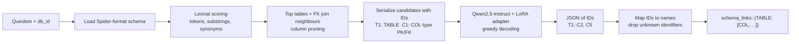

# LLM Schema Linking for Text-to-SQL

LoRA fine-tuning of Qwen2.5 instruction models to predict which tables and columns a natural-language question refers to. The system pairs a lexical schema retriever, which prunes large schemas to a candidate set, with ID-constrained decoding that keeps hallucinated identifiers out of the output. Experiments were orchestrated with RapidFire AI.


---

## Overview

**Schema linking** is the first step of most text-to-SQL systems: given a question such as *"How many orders did each customer place in 2024?"* and a database schema, find the tables and columns the SQL query will need, e.g. `{"ORDERS": ["CUSTOMER_ID", "ORDER_DATE"]}` (illustrative example). Errors here carry into SQL generation. A missed table can't be joined, and an invented column produces invalid SQL.

The task is hard because the schemas are real-world and wide, with cryptic column names (`UTME`, `UTMN`, `SPCODE`). Many questions need multi-table joins, and the training set is small: 301 labelled examples spread over 17 databases. This project fine-tunes small open LLMs (Qwen2.5-0.5B / 1.5B-Instruct) with LoRA. The goal is high table- and column-level precision and recall from a model that runs on a single GPU.

## Highlights

- **Lexical candidate-schema retrieval** (`schema_linking_core.py`). Tables and columns are scored by token overlap and substring matches, after splitting camelCase/snake_case and expanding domain synonym groups (e.g. `easting ↔ utm ↔ x`, `crash ↔ case ↔ accident`). Operator hints help too (date, count, average). Foreign-key **join neighbours** of the top tables are added, and each schema is pruned to a configurable budget (`max_tables`, `max_columns_per_table`), so prompts stay inside the context window even for wide schemas.
- **ID-constrained output format**. Candidates are serialized with types and PK/FK info under stable IDs (`T1`, `C3`), and the model is trained to emit only IDs. The parser maps IDs back to real identifiers, drops anything outside the candidate schema and normalizes casing. By construction, the model can't produce a hallucinated table or column name.
- **Train/inference prompt parity**. A single shared module builds the prompts for training, RapidFire data formatting and final inference. Gold identifiers are forced into the candidate set only while building training targets, so a target never points at a hidden column. They are never forced at inference.
- **Data pipeline** (`scripts/prepare_data.py`). Schema serialization, validation of gold links against the schema, alphabetical normalization, and light per-database oversampling (capped at 2x for databases with fewer than 10 examples). It writes dataset statistics to `data/data_stats.json`: 301 original + 32 oversampled training examples, 141 of them multi-table.
- **Targeted augmentation selection** (`scripts/select_examples_for_augmentation.py`). A difficulty score combines under-represented databases, table/column counts, empty-column tables, joins, aggregations, nested sub-queries and question length. The highest-scoring examples are picked for paraphrase augmentation.
- **LoRA / QLoRA trainer** (`scripts/train_one_config.py`). JSON-config-driven LoRA on all attention and MLP projections (`q,k,v,o,gate,up,down`). It supports optional 4-bit NF4 QLoRA, continued training from an existing adapter (`init_adapter`), per-database balancing, and gradient checkpointing.
- **RapidFire AI multi-config SFT** (`scripts/rapidfire_train_8.py`, `scripts/rapidfire_train_targeted.py`). An `RFGridSearch` sweeps base model size, LoRA rank, learning rate and training length, with chunk-based scheduling on one GPU.
- **Automated adapter selection** (`scripts/evaluate_experiment_grid.py`). The script runs inference and the official scorer on every checkpoint, writes a leaderboard, and promotes the best adapter to `./adapter`.

## How it works



Training follows the same path, with the gold links serialized as the assistant target. The adapter shipped in `adapter/` is a Qwen2.5-1.5B-Instruct LoRA (r = 64, alpha = 128, dropout 0.05, all seven projection modules; see `adapter/adapter_config.json`). It was produced by continued training (`init_adapter`) from an earlier r = 64 adapter: run `continue_best_wide_targeted_lr2e5_steps160`, LR 2e-5, 160 steps. The run config (`adapter/run_config.json`) records the wider retrieval budget used: up to 24 tables, 32 columns per table and 4 join neighbours, with a 6,144-token input.

## Results

### Final model

The shipped adapter (`adapter/`, Qwen2.5-1.5B-Instruct + LoRA r = 64, continued training on targeted examples) scores **0.5702** on the leaderboard metric over all 101 validation questions, with **zero schema-invalid identifiers** (source: `results/final_validation_eval.txt`):

| | Precision | Recall | F1 | Score |
|---|---|---|---|---|
| **Tables** | 0.6675 | 0.6757 | 0.6509 | **0.6647** |
| **Columns** | 0.4705 | 0.5046 | 0.4517 | **0.4756** |
| **Leaderboard** | | | | **0.5702** |

That is a **+29% relative improvement** over the best run of the initial RapidFire grid below (0.4427).

### Metric

Scores are on the 101-question validation split, computed with the course scorer (`eval.py`):

```
Table Score  = (P_T + R_T + F1_T) / 3        Column Score = (P_C + R_C + F1_C) / 3
Leaderboard  = 0.5 * Table Score + 0.5 * Column Score
```

Column matches must also be attributed to the right table, and hallucinated identifiers count as false positives.

### RapidFire AI LoRA grid

Source: `results/lora_leaderboard.csv`. The best run is in `results/best_run.json`. Hyper-parameters come from the matching entry of the config list in `scripts/rapidfire_train_8.py`.

| Run | Base model | LoRA r | LR | Steps | Table P | Table R | Table F1 | Column P | Column R | Column F1 | **Leaderboard** |
|---|---|---|---|---|---|---|---|---|---|---|---|
| 6 | Qwen2.5-1.5B-Instruct | 64 | 8e-5 | 340 | 0.4983 | 0.4884 | 0.4828 | 0.3945 | 0.4072 | 0.3850 | **0.4427** |
| 5 | Qwen2.5-1.5B-Instruct | 32 | 2e-4 | 260 | 0.5033 | 0.4835 | 0.4776 | 0.3836 | 0.4039 | 0.3750 | 0.4378 |
| 8 | Qwen2.5-1.5B-Instruct | 48 | 1.5e-4 | 340 | 0.4917 | 0.4546 | 0.4571 | 0.4021 | 0.4037 | 0.3822 | 0.4319 |
| 4 | Qwen2.5-1.5B-Instruct | 32 | 1e-4 | 260 | 0.4818 | 0.4612 | 0.4571 | 0.3526 | 0.3636 | 0.3370 | 0.4089 |
| 7 | Qwen2.5-1.5B-Instruct | 32 (dropout 0.03) | 5e-5 | 340 | 0.4620 | 0.4554 | 0.4425 | 0.3433 | 0.3493 | 0.3288 | 0.3969 |
| 2 | Qwen2.5-0.5B-Instruct | 32 | 1e-4 | 260 | 0.4340 | 0.3828 | 0.3915 | 0.1921 | 0.1898 | 0.1799 | 0.2950 |

All runs used a cosine schedule, effective batch size 8 (1 × 8 gradient accumulation), bf16, and a 2,048-token max length.

What the grid shows:

- **Model scale matters most for columns.** Moving from 0.5B to 1.5B at the same rank, learning rate and steps (run 2 to run 4) lifts column score from 0.1873 to 0.3511 and leaderboard from 0.2950 to 0.4089.
- **Higher rank plus a longer, gentler schedule wins.** At 1.5B, r = 64 with LR 8e-5 for 340 steps (run 6) gave the best column F1 and the best overall score.

The table and column scores are reported in the CSV as `table_score` / `column_score`. For run 6 they are 0.4899 / 0.3955.

## Tech stack

Python 3.10+ · PyTorch · Hugging Face Transformers · PEFT (LoRA / QLoRA) · bitsandbytes (optional) · RapidFire AI (`RFGridSearch`, `RFModelConfig`, `RFLoraConfig`, `RFSFTConfig`) · Hugging Face Datasets · Qwen2.5-Instruct.

## Repository structure

```text
.
├── main.py                       # Inference: question + db_id -> schema_links JSON
├── sample_main.py                # Alternate copy of the entrypoint, selectable via --inference_script
├── schema_linking_core.py        # Schema loading, lexical retrieval, ID prompts, output parsing
├── eval.py                       # Course scorer: table/column P/R/F1 + leaderboard score
├── adapter/
│   ├── adapter_config.json       # Final LoRA config (weights downloaded on first run)
│   └── run_config.json           # Retrieval + training config of the shipped adapter
├── scripts/
│   ├── prepare_data.py           # Chat-format SFT export, validation, balancing, stats
│   ├── select_examples_for_augmentation.py  # Difficulty-scored augmentation candidates
│   ├── train_one_config.py       # Single LoRA/QLoRA run from a JSON config
│   ├── rapidfire_train_8.py      # RapidFire AI 8-config SFT grid
│   ├── rapidfire_train_targeted.py  # RapidFire AI grid on targeted/oversampled data
│   └── evaluate_experiment_grid.py  # Evaluate all checkpoints, write leaderboard, promote best
├── data/
│   ├── data_stats.json           # Train/validation statistics (no raw data)
│   └── preprocessing_config.json
└── results/
    ├── lora_leaderboard.csv      # RapidFire grid validation scores
    └── best_run.json
```

## Data

The course dataset is **not redistributed** in this repository, and `.gitignore` excludes it. To run the code, place files in the following format in the repo root:

- `schemas/<db_id>.json`: one Spider-format schema per database (`table_names_original`, `column_names_original` as `[table_idx, name]` pairs with a synthetic `[-1, "*"]` entry, `column_types`, `primary_keys`, `foreign_keys`). Spaces in `db_id` map to underscores in the filename.
- `train.json` / `validation.json`: lists of `{"question_id", "db_id", "question", "gold_sql", "schema_links"}`, where `schema_links` is `{"TABLE": ["COL", ...]}` and a table referenced without specific columns maps to `[]`.
- `validation_input.json`: `{"question_id", "db_id", "question"}` only. `validation_gold_schema_links.json`: `{"question_id", "schema_links"}`.

The original split has 301 training and 101 validation questions over 17 databases, e.g. `NTSB`, `NYSED_SRC2022`, `ATBI`, `PacificIslandLandbirds` and a family of `SBODemoUS-*` business databases (`data/data_stats.json`).

## Getting started

```bash
git clone https://github.com/sergimarsol/LLM-Schema-Linking-Text-to-SQL.git
cd LLM-Schema-Linking-Text-to-SQL
python -m venv .venv && source .venv/bin/activate
pip install -r requirements.txt
```

**Inference** with the shipped adapter. The base model comes from the Hugging Face Hub. The LoRA weights (`adapter_model.safetensors`) are fetched from Google Drive on first run, or you can place them in `adapter/` yourself.

```bash
python main.py \
  --input validation_input.json \
  --output predictions.json \
  --schemas_dir schemas
```

Optional flags: `--adapter_dir`, `--base_model`, `--max_new_tokens` (default 160), `--max_input_length`, `--torch_dtype` (`auto|bf16|fp16|fp32`), `--device_map`.

**Evaluate:**

```bash
python eval.py \
  --predictions predictions.json \
  --gold validation_gold_schema_links.json \
  --schemas_dir schemas \
  --questions_input validation_input.json \
  --per_question_out per_question.csv
```

**Training and experiments.** The scripts import `schema_linking_core` from the repo root, so run them with `PYTHONPATH=.`:

```bash
# Data statistics + chat-format SFT export
PYTHONPATH=. python scripts/prepare_data.py --train train.json --validation validation.json \
  --schemas schemas --out_dir data/processed --include_types --include_keys --balance

# Pick hard examples for paraphrase augmentation
PYTHONPATH=. python scripts/select_examples_for_augmentation.py --train train.json --max_examples 90

# Single LoRA run (config schema: see "train_config" in adapter/run_config.json)
PYTHONPATH=. python scripts/train_one_config.py --config my_config.json --output_dir runs/my_run

# RapidFire AI 8-config SFT grid, then evaluate every checkpoint and promote the best
PYTHONPATH=. python scripts/rapidfire_train_8.py --experiment_name schema_linking_qwen_lora8
PYTHONPATH=. python scripts/evaluate_experiment_grid.py --mode rapidfire \
  --experiment_dir rf_experiments/schema_linking_qwen_lora8
```

## My contributions

My work focused on:

- **Data engineering:** the preprocessing pipeline (`scripts/prepare_data.py`): schema serialization, gold-link validation, database-balanced oversampling and dataset statistics.
- **Targeted augmentation:** difficulty-scored selection of training examples for augmentation (`scripts/select_examples_for_augmentation.py`).
- **Fine-tuning improvements:** widened the LoRA target modules to all attention and MLP projections, and added hallucination filtering, validated parsing and post-processing of model outputs.
- **Experimentation:** RapidFire AI SFT grid searches over Qwen2.5-0.5B and 1.5B configurations, and the inference entry point (`main.py`).

Developed at UC San Diego (CSE 234, Data Systems for Machine Learning, Spring 2026). Thanks to the course staff for the task, dataset and scorer (`eval.py`), and to the RapidFire AI and Qwen teams for their open-source tools and models.

## License

The code is released under the [MIT License](LICENSE) © 2026 Sergi Marsol and contributors. The course dataset and schemas are not included and are not covered by this license. The Qwen2.5 base models are subject to their own licenses on the Hugging Face Hub.
